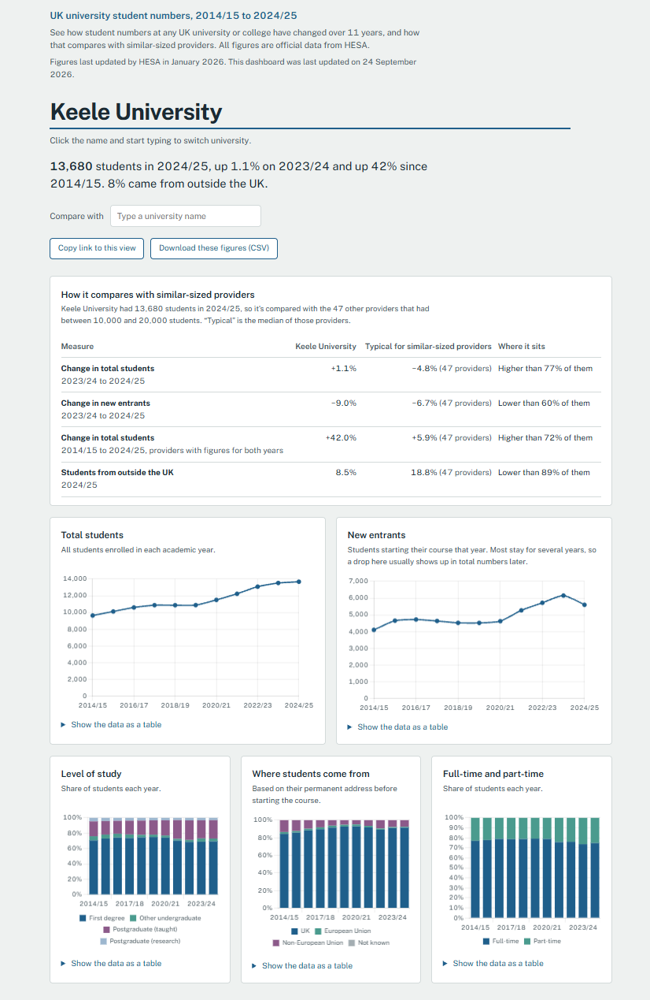

# UK university student numbers dashboard

An interactive dashboard showing how student numbers at every UK university and college have changed from 2014/15 to 2024/25, and how each one compares with providers of a similar size. Built with Python (pandas) for the data work and HTML, CSS and JavaScript (Chart.js) for the dashboard, using official open data from HESA.

**[View the live dashboard](https://chelsea-m-d.github.io/uk-university-dashboard/dashboard/)**



## What it does

Choose a university and the dashboard shows:

- **A plain-English summary** of its student numbers, its change on the previous year and since 2014/15, and its share of students from outside the UK
- **How it compares with similar-sized providers**: the change in total students and new entrants, long-term growth and international share, against the median for providers in the same size band
- **Five charts**: total students, new entrants, level of study, where students come from, and full-time versus part-time
- **A comparison with a second university**, carried through every chart, the summary and the benchmark table

It also lets you copy a link to the exact view you're looking at, download the figures as a CSV, and read every chart as a table.

The dashboard opens on Keele University, where I studied, but you can search for any of the 358 providers in HESA's data.

## Why I built it

I wanted to build something a university planning team would actually use: a tool that answers "how are we doing, and how does that compare?" rather than just displaying numbers. I designed each part around the questions a first-time user would have and the ways they could misread the data.

## The data

**Source:** [HESA Table 1: HE student enrolments by HE provider](https://www.hesa.ac.uk/data-and-analysis/students/table-1), used under the [Creative Commons Attribution 4.0](https://creativecommons.org/licenses/by/4.0/) licence.

The raw data is 11 CSV files, one per academic year, totalling nearly 2 million rows. It's too large for Excel and for GitHub, so it isn't included in this repository. To reproduce the project, download the source data zip from the HESA page above and extract it into `data/raw/`.

## Cleaning and checking the data

All the data work is in [`notebooks/explore.ipynb`](notebooks/explore.ipynb). The most important part of the project was making sure the numbers were right before building anything on them.

**The main challenge was double counting.** HESA's file includes subtotals alongside the detailed figures: "All" rows for every category, subtotals such as "All undergraduate", and a UK-wide "Total" row listed as if it were a university. Adding up every row would count the same students several times.

**My first filter got this wrong.** It returned 5,726,355 students for 2024/25, almost exactly double the real figure, because it included the UK total row. I caught this by checking against HESA's published total, removed the row, and got 2,863,175.

**I then verified every year against HESA's published totals:**

| Year | My total | HESA's published total | Difference |
|---|---:|---:|---:|
| 2014/15 | 2,315,800 | 2,315,840 | −40 |
| 2015/16 | 2,332,825 | 2,332,825 | 0 |
| 2016/17 | 2,378,020 | 2,378,020 | 0 |
| 2017/18 | 2,415,300 | 2,415,335 | −35 |
| 2018/19 | 2,457,285 | 2,457,250 | +35 |
| 2019/20 | 2,529,850 | 2,529,870 | −20 |
| 2020/21 | 2,747,200 | 2,747,200 | 0 |
| 2021/22 | 2,857,835 | 2,857,855 | −20 |
| 2022/23 | 2,937,260 | 2,937,285 | −25 |
| 2023/24 | 2,900,220 | 2,900,240 | −20 |
| 2024/25 | 2,863,175 | 2,863,180 | −5 |

Every year matches to within 40 students. The small differences are expected, because HESA rounds every figure to the nearest 5 to protect individual students.

**I also checked that the breakdowns add up.** For example, the four levels of study sum to within 95 of the overall total, confirming they don't overlap.

The cleaned dataset (`data/processed/enrolments_clean.csv`) has 32,480 rows and no duplicates. It's matched on each provider's UKPRN (its official ID) rather than its name, so a university's history stays together even if it has changed its name.

## Design decisions

- **The charts start at zero**, so a small dip doesn't look like a collapse.
- **"Typical" means the median**, so one unusual provider can't skew the comparison.
- **Differences of less than half a percentage point are shown as "About typical"**, rather than claiming one figure is higher or lower.
- **The dashboard doesn't show a UK-wide trend.** HESA's coverage grew from 226 providers in 2014/15 to 304 in 2024/25, so part of the apparent growth is simply more providers being counted. Comparing universities with themselves and with each other avoids that problem.
- **Warnings appear automatically** for providers with few students (where rounding distorts percentages), providers whose data starts late or has stopped, and comparisons between providers of very different sizes.
- **Accessibility:** every chart can be read as a table, colours meet WCAG contrast guidelines, and the page works with a keyboard and on mobile.
- **Colour means one thing:** solid blue is always the main university and dashed gold is always the comparison.

## Limitations and next steps

- **Size is a simple way to group providers.** A 12,000-student specialist college is grouped with a 12,000-student general university, even though they're quite different. Next, I'd group by type of institution as well as size.
- **It covers enrolments only.** Adding subject of study, or linking to data such as student outcomes, would make it more useful for planning.
- **It's one table of data.** HESA publishes many more, and the same approach could be applied to them.

## Running it locally

You'll need Python 3.

```
git clone https://github.com/chelsea-m-d/uk-university-dashboard.git
cd uk-university-dashboard
python -m venv .venv
.venv\Scripts\activate        # on Mac or Linux: source .venv/bin/activate
pip install pandas jupyter
```

1. Download the HESA source data and extract it into `data/raw/`.
2. Open `notebooks/explore.ipynb` and click **Run All**. This cleans the data, runs the checks and writes `dashboard/data.json`.
3. Start a local server and open http://localhost:8000:

```
python -m http.server 8000 --directory dashboard
```

The page has to be served rather than opened as a file, because browsers block pages opened directly from your computer from loading `data.json`.

## Project structure

```
uk-university-dashboard/
├── data/
│   ├── raw/              HESA source files (not in the repository)
│   └── processed/        cleaned, verified dataset
├── notebooks/
│   └── explore.ipynb     data cleaning, checks and export
└── dashboard/
    ├── index.html
    ├── style.css
    ├── app.js
    └── data.json         data for the dashboard, built by the notebook
```

## About me

I'm Chelsea Day, a graduate with an MSc in Artificial Intelligence and Data Science (Distinction) from Keele University. [Connect with me on LinkedIn](https://www.linkedin.com/in/chelsea-mday).
